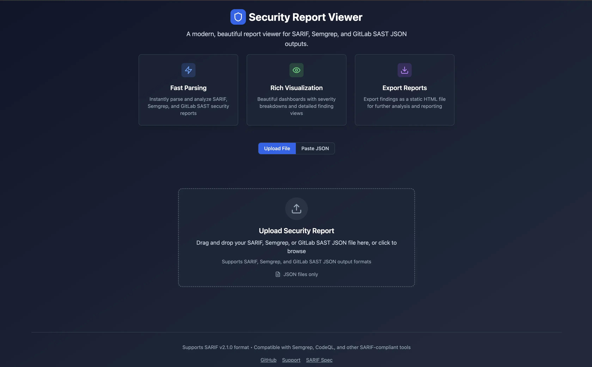
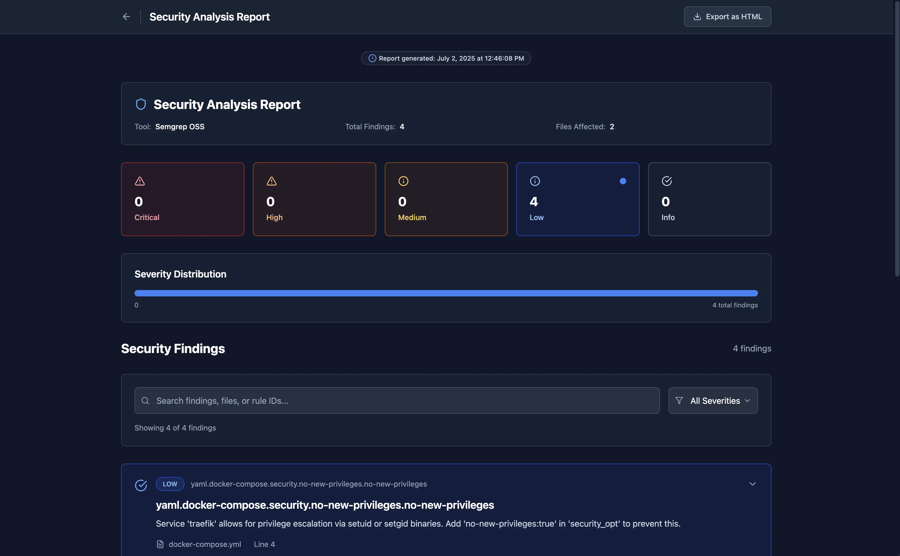
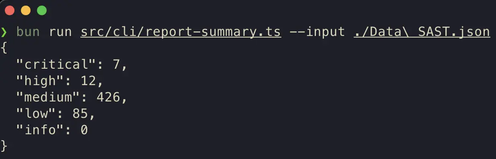

# ICF Sarif Viewer



This can be used as:

- Local UI (containerized)
  - View JSON file reports.
  - Export reports as static HTML.
- CLI Tool
  - Export reports as static HTML.
  - Generate CLI summaries.
- GitHub Action
  - Uses the CLI implementation under the hood.

This is a small application for viewing Sarif JSON files. Either as a local running server to use for local development/debugging or as a CLI and GitHub Action for integration and automation of human readable Sarif JSON reports as static HTML files (like Trivy, same idea).

# Sample Report(s)



# Report Summaries

You can also check the report summary of a Sarif JSON file, which will generate JSON data in the stdout that tells you how many `critial`, `high`, `medium`, `low`, and `info` levels exist within the Sarif JSON file. This is useful for checking, programmatically, if you need to notify someone of the existence of (for example) `critical` and `high` findings.

Below is a screenshot of a sample output from checking a Sarif JSON files summary:



# Quick Start

This will take you through the various ways you can use this utility.

## As a Local (Containerized) Service

This is useful when doing development and you need to regularly review security scans when you generate them. Specically, this is very useful for doing security remediations and re-running scans to check the remediations.

> Run this from the root of the repo.

```bash
make start
```

Visit [http://localhost:9867](http://localhost:9867) in the browser.

If you want an all-in-one command, here you go (NOTE: requires the `gh` CLI):

```bash
gh repo clone ICF-Next-Government/icf-sarif-viewer; cd icf-sarif-viewer; make start; cd ..;
```

## As a CLI Tool

This is best used for programmatically integrating the generation of these static HTML reports from the Sarif JSON file.

> Run from the root of the repo.

```bash
bun src/cli/generate-html-report.ts --input <sarif_json_file> --output <report_html_file>
```

Here is a working example:

```bash
# If there is a "scan.sarif.json" file in the
# root of the repo, then it will generate a
# "report.html" file that contains the viewer
# results.
bun src/cli/generate-html-report.ts --input scan.sarif.json --output report.html
```

## As a GHA

This is best for generating from within a GHA.

```yaml
name: ICF Sarif Report Generator
uses: ICF-Next-Government/icf-sarif-viewer@main
with:
  in: scan.sarif.json
  out: report.html
```

Under the hood this just invokes the CLI method against the varibles you feed it.
