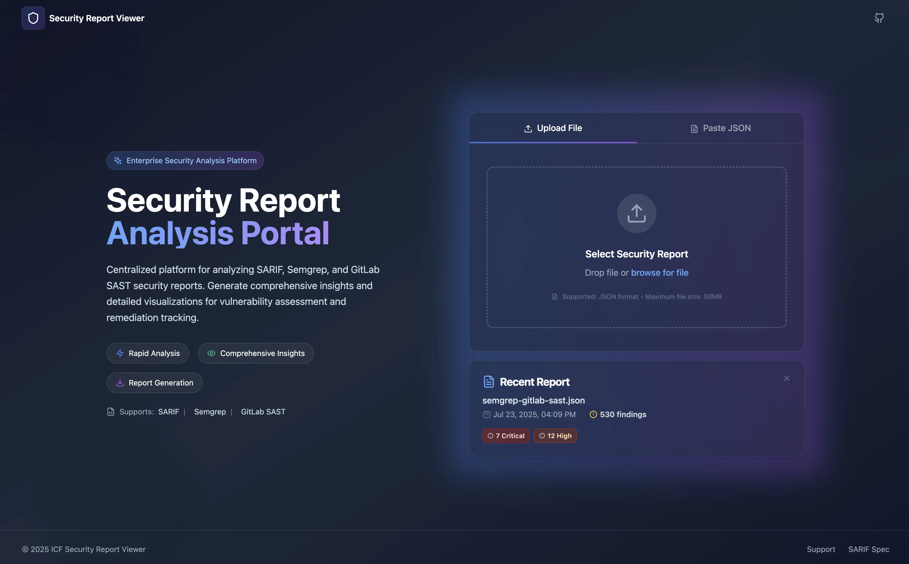
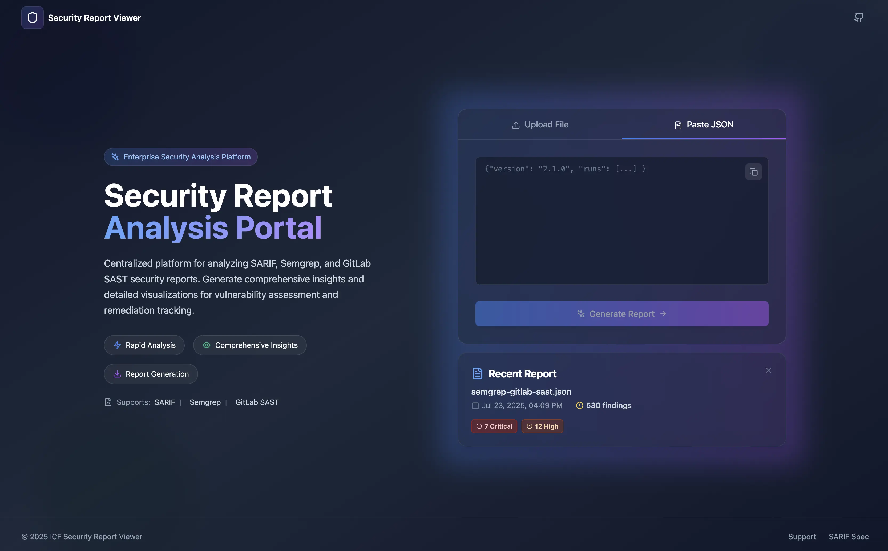
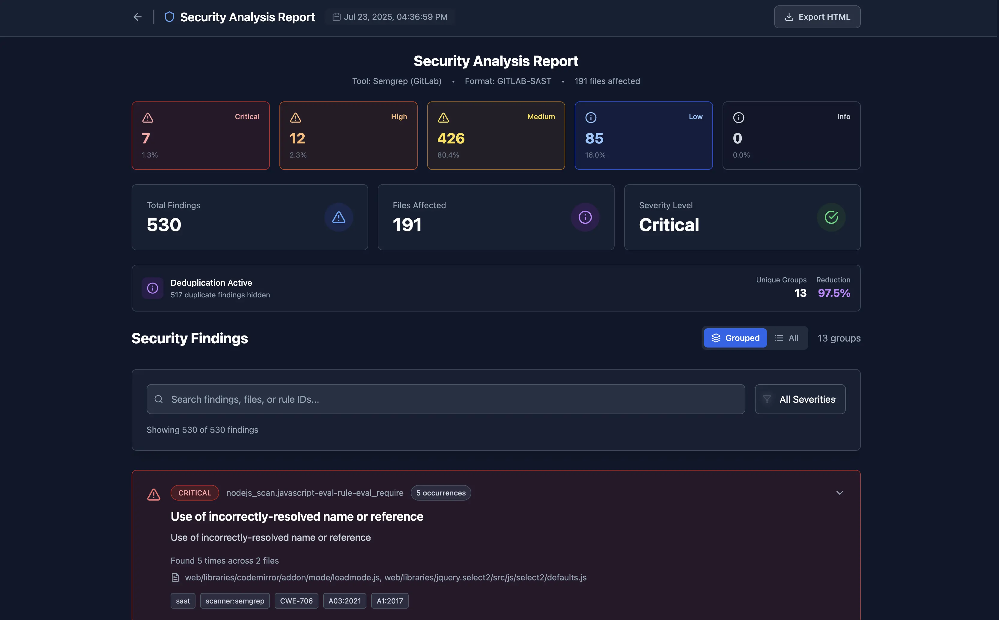

<div align="center">
  
  
</div>

<hr />

<p align="center">
  A modern, interactive security report viewer and static HTML generator for SARIF, Semgrep, and GitLab SAST JSON files. View reports locally with advanced filtering and deduplication, or export as self-contained HTML files for sharing.
</p>





---

## Table of Contents

- [Quick Start: Single Command](#quick-start-single-command)
- [Features](#features)
- [Supported Formats](#supported-formats)
- [Screenshots](#screenshots)
- [Installation](#installation)
  - [Prerequisites](#prerequisites)
  - [Quick Install](#quick-install)
- [Usage](#usage)
  - [Understanding Severity Levels](#understanding-severity-levels)
  - [1. Local Web UI](#1-local-web-ui)
  - [2. CLI Tool](#2-cli-tool)
  - [3. Production Build](#3-production-build)
- [Development](#development)
  - [Setup](#setup)
  - [Docker Usage](#docker-usage)
  - [Project Structure](#project-structure)
- [Key Features Explained](#key-features-explained)
  - [Smart Deduplication](#smart-deduplication)
  - [Embedded Report Data](#embedded-report-data)
  - [Self-Contained HTML](#self-contained-html)
- [Use Cases](#use-cases)
- [License](#license)
- [Contributing](#contributing)
  - [Development Workflow](#development-workflow)
- [Support](#support)

---

## Quick Start: Single Command

These commands are intended to be single-shot commands that will pull the repo, install the packages, and run a production build of the applcation within a Docker container and return you back to the previous directory (to restore your `pwd` context).

> GitHub CLI.

```bash
gh repo clone \
  ICF-Next-Government/ngd-security-report-viewer && \
  cd ngd-security-report-viewer && \
  make start && \
  cd ..
```

> Standard `git` CLI.

```bash
git clone \
  git@github.com:ICF-Next-Government/ngd-security-report-viewer.git && \
  cd ngd-security-report-viewer && \
  make start && \
  cd ..
```

---

## Features

- **🖥️ Local Web UI** - Interactive viewer with real-time search, filtering, and severity-based sorting
- **📄 Static HTML Export** - Self-contained HTML reports with embedded fonts and styles (no external dependencies)
- **🔍 Smart Deduplication** - Automatically groups similar findings to reduce noise
- **📊 Embedded Report Data** - Machine-readable JSON summary embedded in HTML exports
- **🎨 Modern UI** - Dark theme with responsive design and smooth animations
- **⚡ High Performance** - Handles large security reports with thousands of findings

## Supported Formats

- **SARIF** (Static Analysis Results Interchange Format) v2.1.0
- **Semgrep** JSON output
- **GitLab SAST** JSON reports

## Screenshots

### Interactive Report View



### Exported Static HTML


### Report Summary Output


## Installation

### Prerequisites

- [Bun](https://bun.sh/) runtime (v1.0 or higher)
- Or [Node.js](https://nodejs.org/) 20.x or higher

### Quick Install

```bash
# Clone the repository
git clone https://github.com/your-org/ngd-security-report-viewer.git
cd ngd-security-report-viewer

# Install dependencies
bun install

# Build the project
bun run build
```

## Usage

### 1. Local Web UI

Start the development server to interactively view and analyze security reports:

```bash
# Start the development server
bun run dev
```

Visit [http://localhost:5173](http://localhost:5173) in your browser, then drag and drop or select a security report file.

**Features available in the web UI:**

- Upload SARIF, Semgrep, or GitLab SAST JSON files
- Filter by severity, file path, or rule
- Search findings by content
- Group similar findings with deduplication
- Export filtered results as static HTML
- Download as PDF or copy to clipboard

### 2. CLI Tool

#### Generate Static HTML Reports

Convert security scan results to self-contained HTML reports:

```bash
# Basic usage
bun src/cli/generate-html-report.ts --input scan-results.json --output report.html

# Disable deduplication
bun src/cli/generate-html-report.ts --input scan-results.json --output report.html --no-dedup

# View help
bun src/cli/generate-html-report.ts --help
```

The generated HTML files are completely self-contained with:

- All styles and fonts embedded
- No external dependencies
- Machine-readable report summary in `data-report-summary` attribute
- Works offline

#### Extract Report Summary from HTML

The generated HTML files contain embedded report data that can be extracted:

```bash
# Extract the base64-encoded JSON summary
grep -o 'data-report-summary="[^"]*"' report.html | cut -d'"' -f2 | base64 -d

# Pretty print with jq
grep -o 'data-report-summary="[^"]*"' report.html | cut -d'"' -f2 | base64 -d | jq .
```

Example output:

```json
{
  "timestamp": 1234567890,
  "tool": "Semgrep v1.0.0 (SEMGREP)",
  "total_findings": 42,
  "files_affected": 15,
  "severity": {
    "critical": 2,
    "high": 10,
    "medium": 20,
    "low": 8,
    "info": 2
  },
  "deduplication": {
    "unique_groups": 30,
    "duplicate_findings": 12,
    "duplication_rate": "28.6%"
  }
}
```

### 3. Production Build

Build the application for production deployment:

```bash
# Build optimized assets
bun run build

# The build output will be in the dist/ directory
# Serve the dist/ directory with any static web server
```

## Development

### Setup

```bash
# Install dependencies (also installs git hooks)
bun install

# Start development server
bun run dev

# Run tests
bun run test

# Run type checking
bun run type-check

# Run linter
bun run lint

# Build for production
bun run build

# Build without font injection (faster)
bun run build:fast
```

### Docker Usage

The project includes Docker support for containerized deployment:

```bash
# Build and start the container (serves on port 9876)
make start

# Build the Docker image
make build

# Stop and remove containers
make nuke

# Full rebuild (clean + build)
make rebuild
```

The Docker container serves the built application on port 9876.

### Project Structure

```
ngd-security-report-viewer/
├── src/
│   ├── cli/                    # Command-line tools
│   │   ├── generate-html-report.ts
│   │   └── report-summary.ts
│   ├── components/             # React components
│   │   ├── ReportViewer/      # Main viewer component
│   │   ├── FileUpload/        # File upload interface
│   │   └── ...                # Other UI components
│   ├── services/              # Business logic
│   │   └── DeduplicationService.ts
│   ├── shared/                # Shared utilities
│   │   ├── generateHtml.ts    # HTML generation
│   │   └── static-html-export/
│   ├── types/                 # TypeScript definitions
│   └── utils/                 # Utility functions
├── scripts/                   # Build and utility scripts
├── public/                    # Static assets
├── dist/                      # Build output (git-ignored)
├── lefthook.yml              # Git hooks configuration
├── biome.json                # Code formatter and linter config
└── vitest.config.ts          # Test configuration
```

## Key Features Explained

### Smart Deduplication

The viewer automatically groups similar findings based on:

- Rule ID and severity
- File path patterns
- Code snippets and messages

This reduces noise in large reports and helps focus on unique issues.

### Embedded Report Data

All generated HTML files include a `data-report-summary` attribute containing:

- Timestamp and tool information
- Finding counts by severity
- Deduplication statistics
- Files affected

This enables programmatic extraction and analysis of report data.

### Self-Contained HTML

Generated reports include:

- All CSS styles inline
- Base64-encoded font files
- No external JavaScript dependencies
- Complete functionality offline

## Use Cases

- **Security Engineers**: Review and triage vulnerabilities with advanced filtering
- **DevOps Teams**: Generate static reports for artifact storage
- **Security Auditors**: Create professional reports for compliance documentation
- **Development Teams**: Track and prioritize security remediation efforts
- **Automation**: Extract report summaries for dashboards and metrics

## License

This project is licensed under the MIT License - see the LICENSE file for details.

## Contributing

Contributions are welcome! Please feel free to submit a Pull Request.

### Development Workflow

1. Fork the repository
2. Create a feature branch (`git checkout -b feat/amazing-feature`)
3. Make your changes
4. Ensure tests pass (`bun run test`)
5. Ensure code is formatted (`bun run lint`)
6. Commit your changes (git hooks will run automatically)
7. Push to your branch
8. Open a Pull Request

Note: Pre-commit hooks are automatically installed and will run linting and tests before each commit.

### Commit Message Format

This project includes a commit message template to help maintain consistent commit messages. To use it locally:

```bash
# Set up the commit template for this repository
git config commit.template .gitmessage
```

The template follows the conventional commits format:
- `feat`: New feature for the user
- `fix`: Bug fix for the user
- `docs`: Documentation changes
- `style`: Code style changes (formatting, etc.)
- `refactor`: Code refactoring
- `test`: Test additions or changes
- `chore`: Build process or auxiliary tool changes
- `perf`: Performance improvements
- `ci`: CI configuration changes
- `build`: Build system or dependency changes
- `revert`: Reverts a previous commit

### Pull Request Process

This project includes templates to help create consistent Pull Requests and Issues:

- **Pull Request Template**: Automatically loads when creating a new PR
- **Issue Templates**: Choose from Bug Report or Feature Request templates
- **All templates**: Located in `.github/` directory

When submitting a PR:
1. Fill out the PR template completely
2. Link related issues using "Fixes #123" or "Closes #123"
3. Ensure all checklist items are addressed
4. Add screenshots for UI changes
5. Wait for code review and CI checks to pass

## Support

For bugs and feature requests, please open an issue in the GitHub repository.
